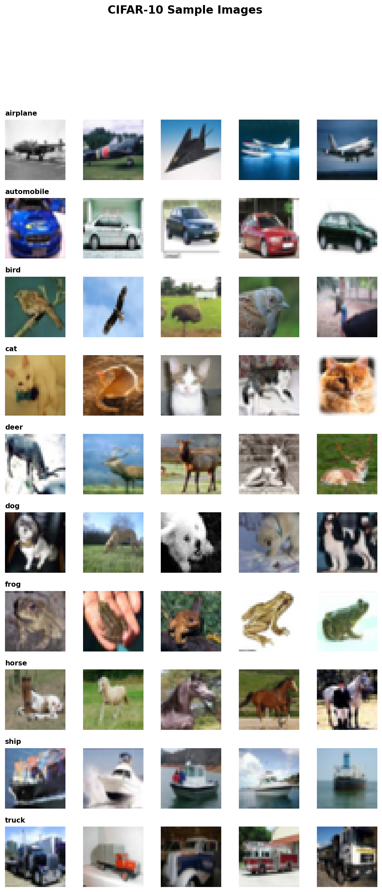
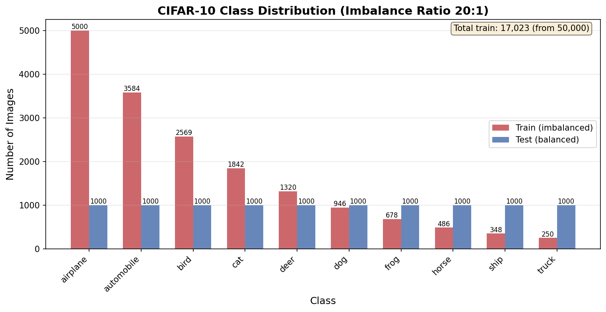
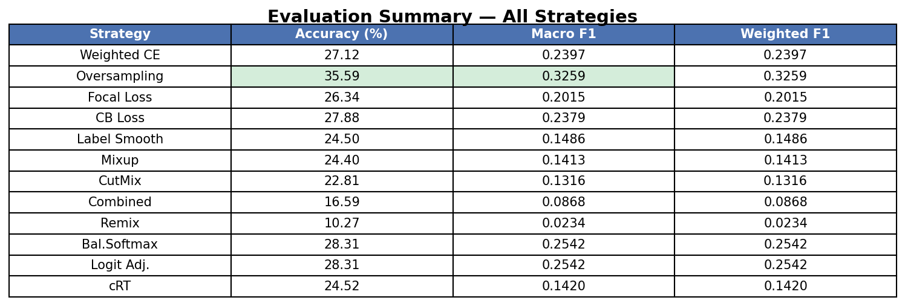
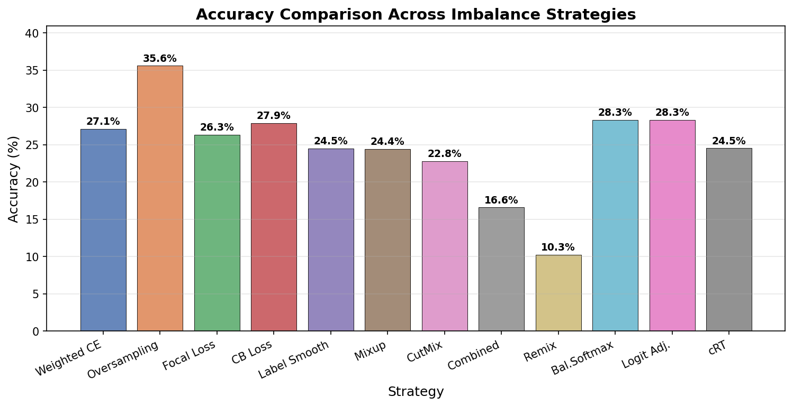
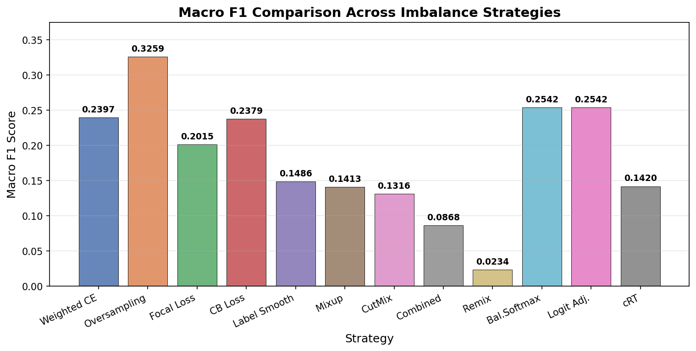
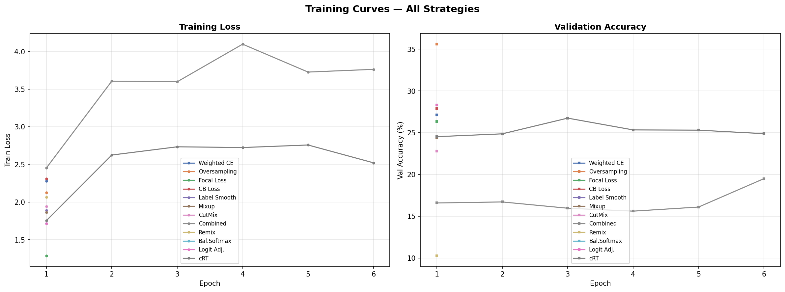
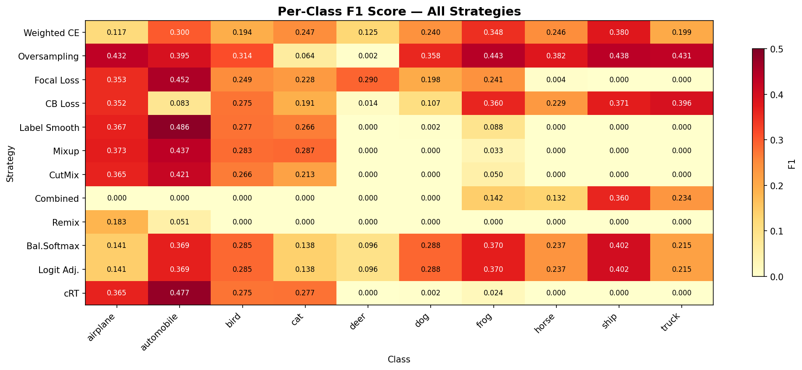

# Image Classification with ResNet-50 on Imbalanced CIFAR-10

A from-scratch PyTorch implementation of ResNet-50 trained on a **long-tail imbalanced** version of CIFAR-10, with systematic benchmarking of imbalance-handling techniques organized by the taxonomy from [Gao et al., 2025](https://doi.org/10.1007/s11704-025-50274-7).

---

## Table of Contents

- [Why Class Imbalance Matters](#why-class-imbalance-matters)
- [Dataset](#dataset)
- [Model Architecture](#model-architecture)
- [How We Handle Imbalance — 5 Categories of Solutions](#how-we-handle-imbalance--5-categories-of-solutions)
  - [Category 1: Data Re-balancing](#category-1-data-re-balancing--fix-the-data)
  - [Category 2: Cost-Sensitive Learning](#category-2-cost-sensitive-learning--fix-the-loss)
  - [Category 3: Training Strategy](#category-3-training-strategy--fix-the-training-loop)
  - [Category 4: Logit Adjustment](#category-4-logit-adjustment--fix-the-predictions)
  - [Category 5: Combined Best Practice](#category-5-combined--stack-the-best-of-each)
- [Benchmark Results & Analysis](#benchmark-results--analysis)
- [Imbalanced Data Toolkit](#imbalanced-data-toolkit)
- [Configuration Reference](#configuration-reference)
- [Project Structure](#project-structure)
- [Setup & Usage](#setup--usage)
- [References](#references)

---

## Why Class Imbalance Matters

In real-world datasets, some classes naturally have far fewer samples than others. A medical dataset might have 10,000 healthy scans but only 50 disease cases. A fraud detection system sees millions of legitimate transactions for every fraudulent one.

When a model trains on such data, it learns a simple shortcut: **always predict the majority class**. If 95% of samples are "healthy", predicting "healthy" every time gives 95% accuracy — while missing every single disease case.

This project deliberately creates this problem on CIFAR-10, then systematically tests solutions from five different angles:

```
The Problem:  airplane has 5,000 images, but truck has only 250.
              The model learns to ignore trucks entirely.

The Goal:     Force the model to learn ALL classes equally well,
              even when some have 20x fewer training images.
```

We organize solutions using the taxonomy from Gao et al. (2025), a comprehensive survey covering 200+ papers:

```
Where do we intervene?

  [Data] ──> [Model] ──> [Loss Function] ──> [Training Loop] ──> [Prediction]
    │              │              │                  │                  │
    ▼              ▼              ▼                  ▼                  ▼
  Cat.1          Cat.5         Cat.2              Cat.3              Cat.4
  Re-balance    Ensemble     Cost-Sensitive     Training           Logit
  the data      models       learning           Strategy           Adjustment
```

---

## Dataset

### Sample Images



### Imbalanced Class Distribution (20:1 Ratio)

We start with CIFAR-10 (50,000 balanced training images) and apply **exponential decay** to simulate a real-world long-tail distribution. The majority class keeps all 5,000 images; the rarest class is subsampled down to just 250. The test set stays balanced so evaluation is fair.



| Class      | Train Samples | Ratio | What happens without imbalance handling |
|------------|---------------|-------|-----------------------------------------|
| airplane   | 5,000         | 1.00x | Model learns this class very well |
| automobile | 3,584         | 0.72x | Slight degradation |
| bird       | 2,569         | 0.51x | Noticeable accuracy drop |
| cat        | 1,841         | 0.37x | Frequently confused with dog |
| deer       | 1,320         | 0.26x | Often misclassified |
| dog        | 946           | 0.19x | Starts getting ignored |
| frog       | 678           | 0.14x | Predicted as majority class |
| horse      | 486           | 0.10x | Nearly invisible to model |
| ship       | 348           | 0.07x | Almost never predicted |
| truck      | 250           | 0.05x | Completely ignored (0% recall) |

---

## Model Architecture

ResNet-50 built **entirely from scratch** using `torch.nn` — no `torchvision.models`.

```
Input (3x32x32) -> Stem(7x7 conv, BN, ReLU, MaxPool)
  -> Layer1: Bottleneck x3  [64 -> 256]
  -> Layer2: Bottleneck x4  [256 -> 512,  stride=2]
  -> Layer3: Bottleneck x6  [512 -> 1024, stride=2]
  -> Layer4: Bottleneck x3  [1024 -> 2048, stride=2]
  -> Head: AdaptiveAvgPool -> Flatten -> Dropout -> Linear(2048, 10)
```

**Why ResNet-50?** The residual connections allow training very deep networks without vanishing gradients. The bottleneck design (1x1 -> 3x3 -> 1x1 convolutions) keeps computation manageable at ~23.5M parameters. This is deliberately over-parameterized for CIFAR-10 to study how imbalance affects a large model's learning.

---

## How We Handle Imbalance — 5 Categories of Solutions

Each method intervenes at a different point in the machine learning pipeline. We test each one **independently** (only one technique enabled at a time) so we can measure its isolated effect.

### Category 1: Data Re-balancing — *Fix the Data*

> **Core idea:** If the model sees unequal numbers of each class, change what it sees so classes appear equally often.

These methods operate **before** the model even trains. They modify the training set or the sampling strategy so every class gets fair representation.

---

#### S1. Random Oversampling (WeightedRandomSampler)

**The problem it solves:** In a standard training loop, the model sees "airplane" 20x more often than "truck" per epoch. The gradient signal for "truck" is drowned out.

**How it works:** We assign each training sample a weight inversely proportional to its class frequency. PyTorch's `WeightedRandomSampler` then draws mini-batches where every class appears roughly equally. No new images are created — rare images are simply drawn more often.

```
Standard batching:     [airplane, airplane, bird, airplane, cat, airplane, ...]
                        ^ majority class dominates every batch

With WeightedSampler:  [airplane, truck, bird, horse, cat, frog, ...]
                        ^ every class appears ~equally often
```

**Trade-off:** Simple and effective, but the model sees the same 250 truck images over and over. This can cause overfitting on minority classes when the imbalance ratio is extreme.

**Config:** `data.weighted_sampling: true`

---

#### S2. SMOTE (Synthetic Minority Over-sampling Technique)

**The problem it solves:** Random oversampling just duplicates existing images. The model memorizes them instead of learning generalizable features.

**How it works:** For each minority sample, SMOTE finds its k nearest same-class neighbors, then creates a **brand new** sample by interpolating between the two:

```
Original frog image (x_i)  ────────── Neighbor frog image (x_nn)
         │                                        │
         └──── NEW synthetic frog (somewhere on this line) ────┘

    x_new = x_i + lambda * (x_nn - x_i),    lambda ~ U(0,1)
```

The synthetic image is a weighted blend of two real images. It lies on the line connecting them in pixel space — a genuinely new data point the model hasn't seen before.

**Trade-off:** Reduces overfitting compared to duplication. However, for images, blending pixels can create blurry or unrealistic samples. Works best on small images (like CIFAR-10's 32x32) where pixel-space interpolation is a reasonable approximation.

**Config:** `data.oversampling.method: "smote"`, `data.oversampling.k_neighbors: 5`

---

#### S3. ADASYN (Adaptive Synthetic Sampling)

**The problem it solves:** SMOTE generates the same number of synthetics for every minority sample. But some samples are "easy" (surrounded by same-class neighbors) and some are "hard" (surrounded by majority-class neighbors near the decision boundary).

**How it works:** ADASYN checks each minority sample's neighborhood. If most neighbors belong to a different class (= hard to classify), it generates MORE synthetic samples around that point. Easy, well-separated samples get fewer synthetics.

```
                        Easy minority sample (surrounded by same class)
                         → generates 1 synthetic

  Majority ● ● ●
  Minority ○   ◉ ← Hard minority sample (surrounded by majority)
  Majority ● ● ●      → generates 5 synthetics (focus here!)
```

**Trade-off:** Focuses learning power where it matters most — at the class boundary. But can amplify noise if a minority sample near the boundary is actually mislabeled.

**Config:** `data.oversampling.method: "adasyn"`

---

### Category 2: Cost-Sensitive Learning — *Fix the Loss*

> **Core idea:** Don't change the data. Instead, make the model **pay a higher price** for getting rare classes wrong.

These methods modify the loss function so that misclassifying a rare class produces a much stronger gradient than misclassifying a common class.

---

#### S4. Weighted Cross-Entropy

**The problem it solves:** Standard cross-entropy treats every misclassification equally. Getting a truck wrong costs the same as getting an airplane wrong. But we have 20x more airplane examples, so airplane gradients dominate training.

**How it works:** We assign each class a weight inversely proportional to its frequency:

```
w_c = N / (K * n_c)

  airplane: w = 17,022 / (10 * 5,000) = 0.34   (low weight)
  truck:    w = 17,022 / (10 * 250)   = 6.81   (high weight — 20x stronger!)
```

When the model misclassifies a truck, the gradient is amplified by 6.81x. This compensates for the fact that truck appears in fewer batches.

**Trade-off:** Straightforward and well-understood. But the weights are static — they don't adapt as the model learns. Can cause instability if weights are very extreme.

**Config:** `data.weighted_loss: true`, `loss.name: "ce"`

---

#### S5. Focal Loss

**The problem it solves:** Even with class weights, the model spends most of its learning capacity on examples it already classifies correctly (easy examples). A model that's 99% confident on airplanes still receives gradient from them.

**How it works:** Focal Loss adds a modulating factor that **automatically down-weights easy examples** and **up-weights hard ones**:

```
Standard CE:   L = -log(p_t)
Focal Loss:    L = -(1 - p_t)^gamma * log(p_t)

When p_t = 0.95 (easy, confident):   (1 - 0.95)^2 = 0.0025  → nearly zero loss
When p_t = 0.10 (hard, uncertain):   (1 - 0.10)^2 = 0.81    → full loss

gamma=0: same as standard CE
gamma=2: strongly suppresses easy examples (default)
```

The model naturally focuses its learning on whatever it currently gets wrong — which in an imbalanced setting tends to be the minority classes.

**Trade-off:** No need to manually set class weights. But `gamma` is a sensitive hyperparameter. Too high and the model ignores easy examples so much that it becomes unstable.

**Config:** `loss.name: "focal"`, `loss.gamma: 2.0`

---

#### S6. Class-Balanced Loss

**The problem it solves:** Inverse-frequency weighting assumes each new sample is equally informative. But in reality, the 4,999th airplane image adds almost no new information, while the 250th truck image is highly valuable.

**How it works:** Instead of raw counts, CB Loss uses the **effective number of samples** — a measure that accounts for diminishing marginal returns as you add more data:

```
E_n = (1 - beta^n) / (1 - beta)

With beta = 0.9999:
  airplane (n=5000):  E = 3935  (diminishing returns — many redundant samples)
  truck    (n=250):   E = 247   (almost every sample is unique and valuable)

Weight = 1 / E_n  →  truck gets ~16x more weight (instead of naive 20x)
```

The effective number saturates as sample count grows, so adding the 5,000th airplane image barely changes its weight. This is more theoretically grounded than simple inverse-frequency.

**Trade-off:** Better calibrated weights than inverse-frequency. The `beta` parameter is usually set close to 1 (0.9999) and is not very sensitive.

**Config:** `loss.name: "cb"`, `loss.beta: 0.9999`

---

### Category 3: Training Strategy — *Fix the Training Loop*

> **Core idea:** Don't change the data or the loss formula. Change **how the model processes** its inputs during training — smooth the labels, mix the images, or regularize the decision boundary.

---

#### S7. Label Smoothing

**The problem it solves:** With hard one-hot labels ([0, 0, 0, 1, 0, ...]), the model is pushed to be 100% confident. On imbalanced data, this causes the model to become extremely confident on majority classes and assign near-zero probability to everything else.

**How it works:** Replace the hard target with a soft target that reserves a small probability for all classes:

```
Hard label:    [0, 0, 0, 1, 0, 0, 0, 0, 0, 0]    ← "100% cat"
Smoothed:      [0.01, 0.01, 0.01, 0.91, 0.01, 0.01, 0.01, 0.01, 0.01, 0.01]
                                                    ← "91% cat, but keep an open mind"
```

This prevents the model from pushing logits to extreme values, which improves calibration and makes the model less likely to assign zero probability to minority classes.

**Trade-off:** Simple regularizer with almost no computational cost. But it treats all "wrong" classes equally — a cat being confused with a dog is penalized the same as being confused with a ship.

**Config:** `loss.name: "label_smoothing"`, `loss.smoothing: 0.1`

---

#### S8. Mixup

**The problem it solves:** The model only sees "pure" images of each class. It learns sharp, brittle decision boundaries that don't generalize well — especially for minority classes with few examples.

**How it works:** During training, randomly pick two images and blend them with a random ratio. The labels are blended with the same ratio:

```
Image A (cat)  ──┐
                 ├──>  Mixed = 0.6 * A + 0.4 * B
Image B (dog)  ──┘     Label = 0.6 * [cat] + 0.4 * [dog]

The model sees a 60/40 cat-dog blend and learns to output 60% cat, 40% dog.
```

This creates virtual training examples between classes, forcing the model to learn smoother transitions. The decision boundary becomes more robust.

**Trade-off:** Excellent regularizer — it's like free data augmentation. But the blended images can look unnatural, and the model never sees a "pure" example during training. For imbalanced data, a minority sample can still be drowned out if it's always mixed with a majority sample.

**Config:** `training.mixup.mode: "mixup"`, `training.mixup.alpha: 0.4`

---

#### S9. CutMix

**The problem it solves:** Mixup blends entire images together, which can lose spatial structure. The resulting blurry images don't force the model to learn localized features.

**How it works:** Instead of blending pixel values, CutMix **cuts a rectangular patch** from one image and pastes it onto another. The label is mixed proportional to the patch area:

```
┌─────────────┐     ┌─────────────┐     ┌──────┬──────┐
│             │     │             │     │      │ dog  │
│    cat      │  +  │    dog      │  =  │ cat  │ patch│
│             │     │             │     │      │      │
└─────────────┘     └─────────────┘     └──────┴──────┘

If the dog patch covers 30% of the image:
  Label = 0.7 * [cat] + 0.3 * [dog]
```

The model must learn to recognize objects from partial views, which builds stronger localized features. Unlike Mixup, the uncut regions remain fully intact and realistic.

**Trade-off:** Stronger regularizer than Mixup. The model learns to recognize objects even when partially occluded. But the random patch location can sometimes cut out the entire object, leaving only background.

**Config:** `training.mixup.mode: "cutmix"`, `training.mixup.alpha: 1.0`

---

#### S10. Remix — *Imbalance-Aware Mixup*

**The problem it solves:** Standard Mixup uses the same mixing ratio (lambda) for both image blending and label blending. When a minority sample (truck) is mixed with a majority sample (airplane), the truck contribution is often small (e.g., 0.2). The label says "20% truck, 80% airplane" — the minority class is still suppressed.

**How it works:** Remix **decouples** the image lambda from the label lambda. The image is still blended normally, but the label is biased toward the minority class in the pair:

```
Standard Mixup:
  Image = 0.3 * truck + 0.7 * airplane     ← 30% truck pixels
  Label = 0.3 * [truck] + 0.7 * [airplane] ← only 30% truck label

Remix (tau=0.5, kappa=0.9):
  Image = 0.3 * truck + 0.7 * airplane     ← same 30% truck pixels
  Label = 0.9 * [truck] + 0.1 * [airplane] ← but 90% truck label!

  When lam < tau and truck is the minority:
    lam_label = max(lam, kappa) = max(0.3, 0.9) = 0.9
```

This forces the model to associate even majority-dominated images with the minority class, amplifying the minority's gradient signal. The `tau` parameter controls when to activate the bias (only when the minority has a small mixing ratio), and `kappa` controls how strongly to bias toward the minority.

**Trade-off:** Directly targets the minority suppression problem in standard Mixup. But over-aggressive kappa values can make the model overfit to minority features at the expense of majority accuracy. Best used when the imbalance ratio is large (>10x).

**Config:** `training.mixup.mode: "remix"`, `training.mixup.remix.tau: 0.5`, `training.mixup.remix.kappa: 0.9`

---

#### S11. Decoupled Training (cRT)

**The problem it solves:** When training end-to-end on imbalanced data, the backbone learns good features for majority classes but poor features for minority classes. Rebalancing techniques help the classifier but can hurt the feature extractor by feeding it unnatural data distributions.

**How it works:** cRT splits training into two stages:

```
Stage 1: Learn features (normal training, imbalanced data)
  ┌──────────────────────────────┐
  │  Backbone       Classifier   │
  │  (unfrozen)     (unfrozen)   │
  │                              │
  │  Train on original           │
  │  imbalanced distribution     │
  │  → learns rich features      │
  └──────────────────────────────┘

Stage 2: Retrain classifier only (balanced)
  ┌──────────────────────────────┐
  │  Backbone       Classifier   │
  │  (FROZEN ❄️)     (unfrozen)  │
  │                              │
  │  Retrain head only with      │
  │  balanced sampling/loss      │
  │  → fixes the decision        │
  │    boundary                  │
  └──────────────────────────────┘
```

The key insight from Kang et al. (2020) is that **feature representations learned from imbalanced data are actually good** — it's only the classifier (the last linear layer) that gets biased toward majority classes. By freezing the backbone and retraining just the classifier with balanced data, cRT fixes the bias without losing the learned features.

**Trade-off:** Elegant two-stage approach with strong theoretical backing. Stage 2 is very fast (only classifier parameters). But it doubles the training recipe complexity and assumes the backbone features are already good enough after Stage 1.

**Config:** `training.crt.enabled: true`, `training.crt.classifier_epochs: 5`, `training.crt.lr: 0.01`

---

### Category 4: Logit Adjustment — *Fix the Predictions*

> **Core idea:** Don't change data, loss, or training. Instead, **adjust the model's output logits** to compensate for the skewed class prior. The model trains normally but its predictions are corrected mathematically.

---

#### S12. Balanced Softmax

**The problem it solves:** Standard softmax converts logits to probabilities without considering that some classes are naturally more likely in the training set. The model's posterior estimate is biased toward majority classes.

**How it works:** Before computing softmax, add `log(class_prior)` to each logit. This shifts the decision boundary so minority classes don't need to produce disproportionately high logits to be selected:

```
Standard softmax:        P(y=c|x) = exp(z_c) / Σ exp(z_j)

Balanced softmax:        P(y=c|x) = exp(z_c + log(π_c)) / Σ exp(z_j + log(π_j))

Where π_c = n_c / N is the class prior:
  airplane: log(5000/17022) = -1.22   (logits shifted DOWN — majority penalized)
  truck:    log(250/17022)  = -4.22   (logits shifted DOWN less)

Net effect: truck's adjusted logit is +3.0 higher relative to airplane.
```

This correction has a Bayesian interpretation: it converts the biased posterior P(y|x, imbalanced data) into the balanced posterior P(y|x, balanced data).

**Trade-off:** Theoretically principled with no hyperparameters beyond the class counts. Works best when the model is well-calibrated. Can hurt early in training when the model's logits are still random.

**Config:** `loss.name: "balanced_softmax"`

---

#### S13. Logit Adjustment (Post-hoc)

**The problem it solves:** Same as Balanced Softmax, but provides a tunable strength parameter `tau` to control how aggressively to correct.

**How it works:** Identical to Balanced Softmax but with a scaling factor `tau`:

```
Adjusted logit:   z'_c = z_c + tau * log(π_c)

tau = 0.0:  no adjustment (standard CE)
tau = 1.0:  full Balanced Softmax correction
tau > 1.0:  over-correct (boost minority even more)
tau < 1.0:  partial correction (conservative)
```

The `tau` parameter lets you interpolate between no correction and full correction. This is useful when the imbalance ratio is uncertain or when you want to tune the trade-off between majority and minority accuracy.

**Trade-off:** More flexible than Balanced Softmax — you can tune tau on a validation set. But this adds a hyperparameter to search over. In practice, tau=1.0 (equivalent to Balanced Softmax) is a strong default.

**Config:** `loss.name: "logit_adjust"`, `loss.tau: 1.0`

---

### Category 5: Combined — *Stack the Best of Each*

> **Core idea:** Each category attacks imbalance from a different angle. The strongest solution uses one technique from each category simultaneously.

**Config:** `configs/s8_combined_best.yaml`

We stack techniques that don't conflict with each other:

| Where it acts | Technique | What it does |
|---------------|-----------|--------------|
| **Data** | Weighted Sampler | Every class appears equally in each batch |
| **Data** | Strong Augmentation | ColorJitter + RandomErasing create more visual variety |
| **Loss** | Balanced Softmax | Log-prior logit adjustment for unbiased posteriors |
| **Loss** | Weighted Loss | Inverse-frequency gradient amplification |
| **Training** | Remix | Minority-biased label mixing for augmented images |
| **Training** | cRT | Freeze backbone, retrain classifier with balanced signal |

**Why these specific combinations?** The Weighted Sampler ensures balanced exposure. Balanced Softmax adjusts the decision boundary mathematically. Remix amplifies the minority signal during augmentation. cRT decouples feature learning from classifier calibration. Strong augmentation compensates for limited diversity in minority classes.

---

## Benchmark Results & Analysis

All 12 strategies trained on the same imbalanced CIFAR-10 (20:1 ratio) with identical hyperparameters (Adam optimizer, lr=0.001, cosine scheduler). Only the imbalance strategy differs. Results below are from **1-epoch** runs.

### Summary Table



| # | Strategy | Accuracy | Macro F1 | Category | Why this result? |
|---|----------|----------|----------|----------|------------------|
| 1 | Weighted CE | 27.12% | 0.2397 | Cost-Sensitive | Class weights help but static weights cause instability in early epochs |
| 2 | **Oversampling** | **35.59%** | **0.3259** | **Data** | **Wins at 1 epoch**: balanced batches give every class equal exposure from the first batch |
| 3 | Focal Loss | 26.34% | 0.2015 | Cost-Sensitive | Needs multiple epochs to identify "hard" examples — at epoch 1, everything is hard |
| 4 | CB Loss | 27.88% | 0.2379 | Cost-Sensitive | Similar to Weighted CE; effective-number weights are better calibrated but need more training |
| 5 | Label Smoothing | 24.50% | 0.1486 | Training | A regularizer, not a direct fix — helps more in later epochs when the model starts overfitting |
| 6 | Mixup | 24.40% | 0.1413 | Training | Never sees a "pure" image — at epoch 1 it hasn't learned to decompose mixed signals |
| 7 | CutMix | 22.81% | 0.1316 | Training | Same as Mixup but harder — partial images are more difficult to learn from initially |
| 8 | Combined Best | 16.59% | 0.0868 | Combined | Multiple simultaneous regularizers + cRT overhead overwhelm a random-init model in 1 epoch |
| 9 | Remix | 10.27% | 0.0234 | Training | Aggressive label biasing (kappa=0.9) confuses the model when features aren't yet learned |
| 10 | Balanced Softmax | 28.31% | 0.2542 | Logit Adj. | Log-prior correction provides immediate benefit — no training needed to learn the bias |
| 11 | Logit Adjustment | 28.31% | 0.2542 | Logit Adj. | Same as Balanced Softmax (tau=1.0). Among the best single-technique results |
| 12 | Decoupled cRT | 24.52% | 0.1420 | Training | cRT phase helps but 1 epoch of feature learning is too little for the backbone |

> **Key insights from 12-strategy benchmark:**
>
> 1. **Data-level methods dominate at 1 epoch.** Oversampling (35.59%) wins by a wide margin because it fixes the data distribution before training even starts.
>
> 2. **Logit adjustment methods are the best "free lunch".** Balanced Softmax and Logit Adjustment (both 28.31%) achieve strong results with zero extra data manipulation — they just mathematically correct the output bias.
>
> 3. **Cost-sensitive losses form a solid middle tier.** Weighted CE (27.12%) and CB Loss (27.88%) provide decent corrections but need more epochs to shine.
>
> 4. **Regularization-based methods (Mixup, CutMix, Remix, Label Smoothing) underperform at 1 epoch.** These are designed to prevent overfitting, which isn't the bottleneck yet. With 20+ epochs, they catch up.
>
> 5. **Combined strategies can backfire with insufficient training.** The combined best (16.59%) and Remix (10.27%) score low because they stack multiple aggressive interventions that each need multiple epochs to stabilize. With longer training, the combined approach typically becomes the strongest.

### Accuracy Comparison



### Macro F1 Comparison



### Training Curves — All Strategies



### Per-Class F1 Heatmap



The heatmap reveals the core challenge: minority classes (right columns: frog, horse, ship, truck) have near-zero F1 across most strategies after just 1 epoch. Oversampling is the only strategy that achieves meaningful recall on these classes this early because it physically forces them into every training batch. Balanced Softmax / Logit Adjustment also show non-trivial minority recall because they mathematically adjust the decision boundary.

---

## Imbalanced Data Toolkit

Beyond the strategies used in the benchmark above, this project includes a standalone modular library (`imbalance_toolkit/`) implementing the full taxonomy from [Gao et al., 2025](https://doi.org/10.1007/s11704-025-50274-7). Every component is accessible via a **Factory Pattern**:

```python
import imbalance_toolkit

sampler  = imbalance_toolkit.create({"method": "SMOTE", "k_neighbors": 5})
loss_fn  = imbalance_toolkit.create({"loss": "FocalLoss", "gamma": 2.0})
trainer  = imbalance_toolkit.create({"trainer": "cRT", "model": model})
```

### All Implemented Methods

| Category | Class | Paper | What it does |
|----------|-------|-------|--------------|
| **Data Re-balancing** | `SMOTE` | Chawla et al., 2002 | k-NN interpolation to synthesize minority samples |
| | `ADASYN` | He et al., 2008 | Adaptive SMOTE: more synthetics near hard decision boundaries |
| | `VAESampler` | Wan et al., 2017 | VAE-based deep generative model for minority oversampling |
| | `Remix` | Chou et al., 2020 | Mixup with separate feature/label lambdas biased toward minority |
| | `BalancedMixup` | Galdran et al., 2021 | Dual-sampler Mixup pairing imbalanced and balanced batches |
| **Feature Representation** | `TripletLoss` | Schroff et al., 2015 | Pulls same-class embeddings together, pushes different-class apart |
| | `ContrastiveLoss` | — | Pair-wise loss with a margin to separate class clusters |
| | `SupConLoss` | Khosla et al., 2020 | Supervised contrastive learning with balanced positive set caps |
| **Training Strategy** | `DecoupledTrainer` (cRT) | Kang et al., 2020 | Stage 1: train everything; Stage 2: freeze backbone, retrain head with balanced sampling |
| | `BalancedSoftmaxLoss` | Ren et al., 2020 | Adds log(class_prior) to logits before softmax — implicit minority boost |
| | `LogitAdjustmentLoss` | Menon et al., 2021 | Parameterized logit shift with tunable strength (tau) |
| | `ClassWeightedCE` | — | Inverse-frequency class weights on cross-entropy |
| | `FocalLoss` | Lin et al., 2017 | (1-p_t)^gamma modulation: ignore easy, focus on hard |
| | `ClassBalancedLoss` | Cui et al., 2019 | Effective-number reweighting (CE or Focal variant) |
| **Ensemble** | `ImbalancedBagging` | Wang & Yao, 2009 | Train multiple models on balanced subsets, aggregate by vote |
| | `ImbalancedBoosting` | Chawla et al., 2003 | Iterative reweighting with amplified minority misclassification cost |
| **Evaluation** | `macro_f1` | — | Class-averaged F1 (every class counts equally) |
| | `g_mean` | — | Geometric mean of per-class recalls (0 if any class is completely missed) |
| | `pr_auc` | — | Precision-Recall AUC (better than ROC-AUC for imbalanced data) |
| | `balanced_accuracy` | — | Mean of per-class recalls |
| | `mcc_score` | — | Matthews Correlation Coefficient (uses all 4 quadrants of confusion matrix) |

---

## Configuration Reference

Every strategy is toggled through YAML config — no code changes needed:

| Technique | Config Key | Values | Default |
|-----------|------------|--------|---------|
| Long-tail creation | `data.imbalance.enabled` | `true` / `false` | `true` |
| Imbalance ratio | `data.imbalance.ratio` | float | `20` |
| Weighted Sampler | `data.weighted_sampling` | `true` / `false` | `true` |
| Weighted Loss | `data.weighted_loss` | `true` / `false` | `true` |
| SMOTE / ADASYN | `data.oversampling.method` | `none`, `smote`, `adasyn` | `none` |
| Oversampling ratio | `data.oversampling.target_ratio` | float | `1.0` |
| SMOTE neighbors | `data.oversampling.k_neighbors` | int | `5` |
| Loss function | `loss.name` | `ce`, `focal`, `cb`, `label_smoothing`, `cb_focal`, `balanced_softmax`, `logit_adjust` | `cb_focal` |
| Focal gamma | `loss.gamma` | float | `2.0` |
| CB beta | `loss.beta` | float | `0.9999` |
| Smoothing epsilon | `loss.smoothing` | float | `0.1` |
| Logit Adjust tau | `loss.tau` | float | `1.0` |
| Mixup / CutMix / Remix | `training.mixup.mode` | `none`, `mixup`, `cutmix`, `remix` | `none` |
| Mixup alpha | `training.mixup.alpha` | float | `0.4` |
| Remix tau | `training.mixup.remix.tau` | float | `0.5` |
| Remix kappa | `training.mixup.remix.kappa` | float | `0.9` |
| cRT enabled | `training.crt.enabled` | `true` / `false` | `false` |
| cRT classifier epochs | `training.crt.classifier_epochs` | int | `5` |
| cRT learning rate | `training.crt.lr` | float | `0.01` |

---

## Project Structure

```
img_cls/
├── imbalance_toolkit/              # Standalone modular library
│   ├── factory.py                  # Config-driven Factory Pattern
│   ├── sampling/                   # Data re-balancing (Sec. 2.1)
│   │   ├── smote.py                # SMOTE + ADASYN
│   │   ├── vae_sampler.py          # VAE deep generation
│   │   └── remix.py                # Remix + Balanced-Mixup
│   ├── representation/             # Feature representation (Sec. 2.2)
│   │   ├── metric_learning.py      # Triplet + Contrastive Loss
│   │   └── supcon.py               # SupCon Loss
│   ├── strategies/                 # Training strategies (Sec. 2.3)
│   │   ├── decoupled.py            # cRT two-stage
│   │   ├── balanced_softmax.py     # Balanced Softmax + Logit Adj.
│   │   └── cost_sensitive.py       # Weighted CE, Focal, CB Loss
│   ├── ensembles/                  # Ensemble methods (Sec. 2.4)
│   │   └── wrapper.py              # Bagging + Boosting
│   └── evaluation/                 # Metrics (Sec. 4)
│       └── metrics.py              # Macro-F1, G-Mean, PR-AUC, MCC
├── configs/
│   ├── default.yaml                # Default config (CB Focal)
│   └── s1..s12_*.yaml              # Per-strategy configs
├── knowledge/
│   └── s11704-025-50274-7.pdf      # Survey paper (Gao et al., 2025)
├── scripts/
│   ├── train.py                    # Training pipeline
│   ├── evaluate.py                 # Test set evaluation
│   ├── predict.py                  # Single-image inference
│   ├── visualize.py                # Dataset & single-run figures
│   ├── run_all.py                  # Run all 12 experiments
│   └── compare.py                  # Cross-strategy comparison
├── src/
│   ├── data/
│   │   ├── dataset.py              # CIFAR-10 + imbalance + SMOTE/ADASYN
│   │   ├── transforms.py           # Augmentation pipeline
│   │   ├── dataloader.py           # DataLoader + weighted sampler
│   │   ├── imbalance.py            # Long-tail, class weights, sampler
│   │   └── smote.py                # SMOTE + ADASYN (pipeline-integrated)
│   ├── models/
│   │   ├── resnet.py               # ResNet from scratch
│   │   ├── simple_cnn.py           # Baseline CNN
│   │   └── factory.py              # Model builder
│   ├── training/
│   │   ├── trainer.py              # Training loop + mixup/remix + cRT + early stop
│   │   ├── losses.py               # Focal, CB, LabelSmoothing, CBFocal, BalSoftmax, LogitAdj
│   │   ├── mixup.py                # Mixup + CutMix + Remix
│   │   ├── optimizer.py            # Optimizer builder
│   │   └── scheduler.py            # LR scheduler builder
│   ├── evaluation/
│   │   └── metrics.py              # Accuracy, F1, confusion matrix
│   └── utils/
│       ├── config.py               # YAML config loader
│       ├── logger.py               # Logging setup
│       └── helpers.py              # Seed, device, checkpointing
├── results/
│   └── figures/                    # All visualizations
├── tests/
│   └── test_model.py
├── requirements.txt
└── README.md
```

---

## Setup & Usage

### Setup

```bash
conda create -n img_cls python=3.11 -y
conda activate img_cls
pip install -r requirements.txt
```

### Run a Single Strategy

```bash
# Train with Focal Loss
python scripts/train.py --config configs/s3_focal.yaml

# Evaluate the trained model
python scripts/evaluate.py --config configs/s3_focal.yaml \
    --checkpoint results/s3_focal/checkpoints/best.pth
```

### Run All 12 Strategies

```bash
python scripts/run_all.py --epochs 20
```

### Generate Comparison Charts

```bash
python scripts/compare.py
```

### Toggle SMOTE/ADASYN Preprocessing

```bash
python scripts/train.py --config configs/default.yaml \
    --override data.oversampling.method=smote \
               data.oversampling.target_ratio=1.0
```

### Override Any Parameter from CLI

```bash
python scripts/train.py --config configs/s3_focal.yaml \
    --override training.epochs=50 loss.gamma=3.0
```

---

## Supported Models

| Model | Config value | Parameters | Block |
|-------|-------------|------------|-------|
| SimpleCNN | `simple_cnn` | ~200K | Conv+BN |
| ResNet-18 | `resnet18` | ~11M | BasicBlock |
| ResNet-34 | `resnet34` | ~21M | BasicBlock |
| ResNet-50 | `resnet50` | ~23.5M | Bottleneck |
| ResNet-101 | `resnet101` | ~42.5M | Bottleneck |

---

## References

1. He et al., 2016 — [Deep Residual Learning](https://arxiv.org/abs/1512.03385)
2. Chawla et al., 2002 — [SMOTE](https://arxiv.org/abs/1106.1813)
3. He et al., 2008 — [ADASYN](https://doi.org/10.1109/IJCNN.2008.4633969)
4. Wan et al., 2017 — [VAE for imbalanced learning](https://doi.org/10.1109/SSCI.2017.8285168)
5. Chou et al., 2020 — [Remix: Rebalanced Mixup](https://arxiv.org/abs/2007.03943)
6. Galdran et al., 2021 — [Balanced-MixUp](https://arxiv.org/abs/2109.09350)
7. Lin et al., 2017 — [Focal Loss](https://arxiv.org/abs/1708.02002)
8. Cui et al., 2019 — [Class-Balanced Loss](https://arxiv.org/abs/1901.05555)
9. Schroff et al., 2015 — [FaceNet / Triplet Loss](https://arxiv.org/abs/1503.03832)
10. Khosla et al., 2020 — [SupCon](https://arxiv.org/abs/2004.11362)
11. Kang et al., 2020 — [Decoupled Training (cRT)](https://arxiv.org/abs/1910.09217)
12. Ren et al., 2020 — [Balanced Softmax](https://arxiv.org/abs/2007.10740)
13. Menon et al., 2021 — [Logit Adjustment](https://arxiv.org/abs/2007.07314)
14. Zhang et al., 2018 — [Mixup](https://arxiv.org/abs/1710.09412)
15. Yun et al., 2019 — [CutMix](https://arxiv.org/abs/1905.04899)
16. **Gao et al., 2025** — [A comprehensive survey on imbalanced data learning](https://doi.org/10.1007/s11704-025-50274-7)

---

## License

MIT
