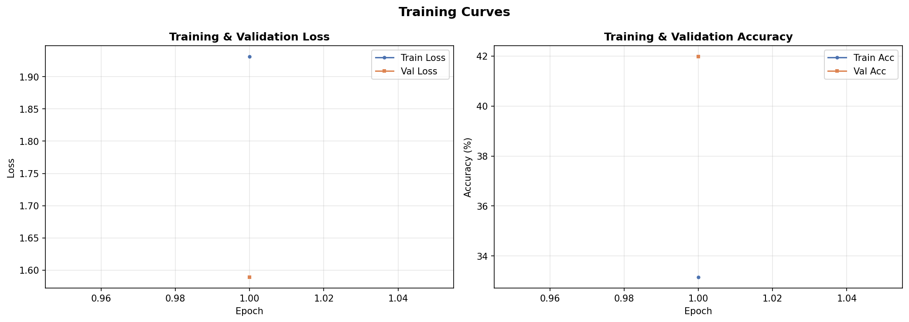
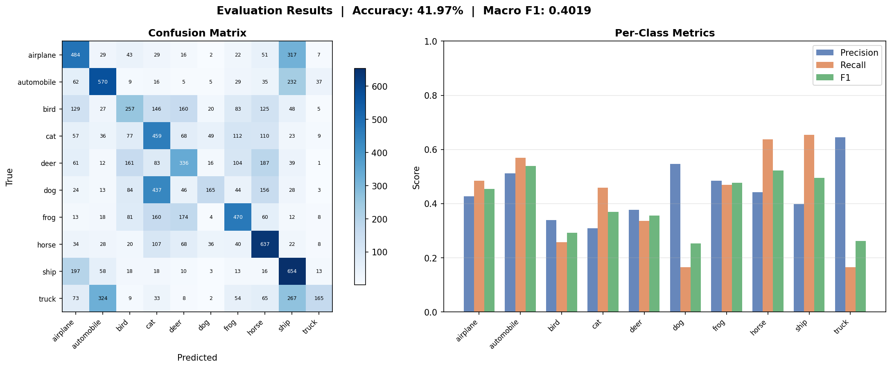

# Image Classification with ResNet-50 on CIFAR-10

A from-scratch PyTorch implementation of ResNet-50 trained on CIFAR-10, with built-in solutions for class-imbalanced datasets.

---

## Table of Contents

- [Dataset Visualization](#dataset-visualization)
- [Model Architecture](#model-architecture)
- [Configuration](#configuration)
- [Handling Imbalanced Data](#handling-imbalanced-data)
- [Training & Evaluation Results](#training--evaluation-results)
- [Project Structure](#project-structure)
- [Setup](#setup)
- [Usage](#usage)
- [Supported Models](#supported-models)

---

## Dataset Visualization

### Sample Images

Each row shows 5 random samples from one of the 10 CIFAR-10 classes.


### Class Distribution

CIFAR-10 contains 60,000 32x32 color images split across 10 classes.

| Split | Images | Per Class |
|-------|--------|-----------|
| Train | 50,000 | 5,000     |
| Test  | 10,000 | 1,000     |


**Classes:** airplane, automobile, bird, cat, deer, dog, frog, horse, ship, truck

---

## Model Architecture

ResNet-50 implemented **entirely from scratch** using `torch.nn` — no `torchvision.models`.

### Architecture Overview

```
Input (3 x 32 x 32)
  │
  ├── Stem: Conv2d(7x7, 64, stride=2) → BN → ReLU → MaxPool(3x3, stride=2)
  │
  ├── Layer 1: Bottleneck × 3  [64  → 256  channels]
  ├── Layer 2: Bottleneck × 4  [256 → 512  channels, stride=2]
  ├── Layer 3: Bottleneck × 6  [512 → 1024 channels, stride=2]
  ├── Layer 4: Bottleneck × 3  [1024→ 2048 channels, stride=2]
  │
  ├── Head: AdaptiveAvgPool → Flatten → Dropout → Linear(2048, 10)
  │
  └── Output: 10 class logits
```

### Bottleneck Block Detail

```
x ──┬── Conv1x1(in→mid) → BN → ReLU
    │   Conv3x3(mid→mid) → BN → ReLU
    │   Conv1x1(mid→mid×4) → BN
    │                          │
    └── [downsample if needed] ┘ → + → ReLU → out
```

### Layer-by-Layer Summary

| Layer   | Output Size | Block Structure                  | Repeat |
|---------|-------------|----------------------------------|--------|
| stem    | 56 × 56     | 7×7 conv, 64, stride 2 + maxpool | 1      |
| layer1  | 56 × 56     | [1×1, 64 / 3×3, 64 / 1×1, 256]  | 3      |
| layer2  | 28 × 28     | [1×1, 128 / 3×3, 128 / 1×1, 512]| 4      |
| layer3  | 14 × 14     | [1×1, 256 / 3×3, 256 / 1×1, 1024]| 6     |
| layer4  | 7 × 7       | [1×1, 512 / 3×3, 512 / 1×1, 2048]| 3     |
| head    | 10          | AdaptiveAvgPool → FC             | 1      |

**Total parameters: 23,528,522 (~23.5M)**

### Weight Initialization

- **Conv2d**: Kaiming normal (fan_out, ReLU)
- **BatchNorm2d**: weight=1, bias=0
- **Linear**: normal(0, 0.01), bias=0

---

## Configuration

All hyperparameters are centralized in `configs/default.yaml`:

| Category        | Parameter        | Value                |
|-----------------|------------------|----------------------|
| **Model**       | Architecture     | ResNet-50            |
|                 | Parameters       | 23.5M               |
|                 | Dropout          | 0.0                 |
| **Data**        | Dataset          | CIFAR-10             |
|                 | Image size       | 224 (resized)        |
|                 | Train batch      | 128                  |
|                 | Val batch        | 256                  |
| **Optimizer**   | Type             | Adam                 |
|                 | Learning rate    | 0.001                |
|                 | Weight decay     | 1e-4                 |
| **Scheduler**   | Type             | Cosine Annealing     |
|                 | eta_min          | 1e-5                 |
| **Training**    | Epochs           | 20                   |
|                 | Early stopping   | 10 epochs patience   |
| **Augmentation**| RandomCrop       | Yes                  |
|                 | HorizontalFlip   | Yes                  |
|                 | Normalize        | Yes                  |
| **Imbalance**   | Weighted loss    | Configurable         |
|                 | Weighted sampler | Configurable         |

---

## Handling Imbalanced Data

Real-world datasets are rarely balanced. This project provides two built-in strategies to mitigate class imbalance, configurable via `default.yaml`:

### Strategy 1: Weighted Cross-Entropy Loss

Assigns higher loss penalties to under-represented classes using inverse-frequency weights:

$$w_c = \frac{N}{K \times n_c}$$

where N = total samples, K = number of classes, n_c = samples in class c.

**Enable in config:**

```yaml
data:
  weighted_loss: true
```

**How it works:** Classes with fewer samples get higher weights, forcing the model to pay more attention to rare classes during gradient updates.

### Strategy 2: Weighted Random Sampler

Oversamples minority classes so each batch has roughly equal representation:

**Enable in config:**

```yaml
data:
  weighted_sampling: true
```

**How it works:** Each sample gets a probability inversely proportional to its class frequency. The sampler draws with replacement, so rare-class samples appear more often per epoch.

### When to Use Which

| Strategy         | Best For                        | Trade-off                          |
|------------------|---------------------------------|------------------------------------|
| Weighted Loss    | Mild imbalance (2x–5x ratio)   | Simple, no data duplication        |
| Weighted Sampler | Severe imbalance (10x+ ratio)  | Balanced batches, possible overfit |
| Both combined    | Extreme imbalance              | Strongest correction               |

### Implementation

```python
# src/data/imbalance.py

# Inverse-frequency weights for loss
weights = compute_class_weights(train_dataset)
criterion = nn.CrossEntropyLoss(weight=weights.to(device))

# Weighted sampler for balanced batches
sampler = build_weighted_sampler(train_dataset)
loader = DataLoader(dataset, sampler=sampler)
```

---

## Training & Evaluation Results

### Training Curves

Loss and accuracy over epochs for both training and validation sets.



### Evaluation Metrics

| Metric       | Value  |
|--------------|--------|
| Accuracy     | 41.97% |
| Macro F1     | 0.4019 |
| Weighted F1  | 0.4019 |

### Per-Class Performance

| Class      | Precision | Recall | F1-Score |
|------------|-----------|--------|----------|
| airplane   | 0.4268    | 0.4840 | 0.4536   |
| automobile | 0.5112    | 0.5700 | 0.5390   |
| bird       | 0.3386    | 0.2570 | 0.2922   |
| cat        | 0.3085    | 0.4590 | 0.3690   |
| deer       | 0.3771    | 0.3360 | 0.3554   |
| dog        | 0.5464    | 0.1650 | 0.2535   |
| frog       | 0.4840    | 0.4700 | 0.4769   |
| horse      | 0.4417    | 0.6370 | 0.5217   |
| ship       | 0.3983    | 0.6540 | 0.4951   |
| truck      | 0.6445    | 0.1650 | 0.2627   |

### Confusion Matrix & Per-Class Metrics



> **Note:** Results shown are from a 1-epoch training run for demonstration purposes. Training for the full 20+ epochs will significantly improve performance.

---

## Project Structure

```
img_cls/
├── configs/
│   └── default.yaml              # All hyperparameters
├── scripts/
│   ├── train.py                  # Training pipeline
│   ├── evaluate.py               # Test set evaluation
│   ├── predict.py                # Single-image inference
│   └── visualize.py              # Generate all figures
├── src/
│   ├── data/
│   │   ├── dataset.py            # CIFAR-10/100 loader
│   │   ├── transforms.py         # Augmentation pipeline
│   │   ├── dataloader.py         # DataLoader builder
│   │   └── imbalance.py          # Weighted loss & sampler
│   ├── models/
│   │   ├── resnet.py             # ResNet from scratch
│   │   ├── simple_cnn.py         # Baseline CNN
│   │   └── factory.py            # Model builder
│   ├── training/
│   │   ├── trainer.py            # Training loop + early stopping
│   │   ├── optimizer.py          # Optimizer builder
│   │   └── scheduler.py          # LR scheduler builder
│   ├── evaluation/
│   │   └── metrics.py            # Accuracy, F1, confusion matrix
│   └── utils/
│       ├── config.py             # YAML config loader
│       ├── logger.py             # Logging setup
│       └── helpers.py            # Seed, device, checkpointing
├── results/
│   ├── checkpoints/              # Model weights (.pth)
│   ├── figures/                  # Generated visualizations
│   ├── train_history.json        # Per-epoch metrics
│   └── eval_results.json         # Final evaluation
├── tests/
│   └── test_model.py
├── requirements.txt
└── README.md
```

---

## Setup

```bash
conda create -n img_cls python=3.11 -y
conda activate img_cls
pip install -r requirements.txt
```

## Usage

### Train

```bash
python scripts/train.py --config configs/default.yaml
```

Override any parameter:

```bash
python scripts/train.py --config configs/default.yaml \
    --override training.epochs=50 \
               training.optimizer.lr=0.0005 \
               data.weighted_loss=True \
               data.weighted_sampling=True
```

### Evaluate

```bash
python scripts/evaluate.py \
    --config configs/default.yaml \
    --checkpoint results/checkpoints/best.pth
```

### Predict

```bash
python scripts/predict.py \
    --config configs/default.yaml \
    --checkpoint results/checkpoints/best.pth \
    --input path/to/image.jpg
```

### Generate Visualizations

```bash
python scripts/visualize.py
```

---

## Supported Models

| Model       | Config value  | Parameters | Block      |
|-------------|---------------|------------|------------|
| SimpleCNN   | `simple_cnn`  | ~200K      | Conv+BN    |
| ResNet-18   | `resnet18`    | ~11M       | BasicBlock |
| ResNet-34   | `resnet34`    | ~21M       | BasicBlock |
| ResNet-50   | `resnet50`    | ~23.5M     | Bottleneck |
| ResNet-101  | `resnet101`   | ~42.5M     | Bottleneck |

---

## License

MIT
